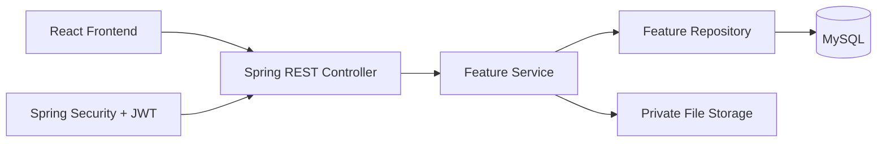

# Backend Architecture — Personal Vault

> **Project**: Personal Vault — secure storage for credentials, personal identity data, and sensitive documents.
> **Architecture**: Monolith, feature-based code organization
> **Audience**: Developers & AI coding assistants working on this codebase

---

## 1. System Overview

Personal Vault uses a **feature-based Spring Boot architecture**. Each feature owns its HTTP endpoints, business logic, database access, DTOs, and tests. Shared code is limited to infrastructure and cross-cutting concerns.



Feature-based organization keeps related code together and makes it easier to add features without creating one large controller, service, or package.

---

## 2. Technology Decisions

| Concern | Choice |
|---|---|
| Language | Java 17+ LTS |
| Framework | Spring Boot |
| Security | Spring Security with JWT access/refresh tokens |
| Persistence | Spring Data JPA + Hibernate |
| Database | MySQL |
| Schema migration | Flyway |
| Validation | Jakarta Bean Validation |
| Files | Private filesystem/object storage; MySQL stores metadata only |

---

## 3. Folder Structure

> Java package names cannot contain hyphens. The project may be named `personal-vault`, but the Java base package uses `com.tuyen.personalvault`.

```text
src/main/java/com/tuyen/personalvault/
├── PersonalVaultApplication.java
├── config/                         # Spring and application configuration
├── shared/
│   ├── exception/                  # Global exception handling
│   ├── response/                   # Common API response model
│   ├── security/                   # JWT and current-user helpers
│   └── util/                       # Small generic utilities
└── features/
    ├── auth/                       # Register, login, refresh, logout
    ├── users/                      # Profile and user account data
    ├── credentials/                # Encrypted platform credentials
    ├── documents/                  # Private document metadata and files
    └── admin/                      # Account administration
```

**Database migrations**:

```text
src/main/resources/db/migration/
├── V1__create_users_table.sql
├── V2__create_credentials_table.sql
└── V3__create_documents_table.sql
```

---

## 4. Feature Anatomy

```text
features/credentials/
├── controller/                     # REST endpoints
├── service/                        # Business rules and transactions
├── repository/                     # JPA queries
├── dto/                            # Request and response objects
├── entity/                         # JPA entities
├── mapper/                         # Entity/DTO conversion
├── exception/                      # Feature-specific exceptions
└── CredentialContext.md            # Decisions and feature flow
```

**Layer responsibilities**:

| Layer | Responsibility |
|---|---|
| Controller | Receives HTTP requests and delegates to a service |
| Service | Applies business rules and defines transaction boundaries |
| Repository | Performs database access only |
| DTO | Defines the API contract — entities are never returned directly |
| Entity | Maps Java objects to MySQL tables |
| Mapper | Converts entities to response DTOs |

---

## 5. Request Flow

```text
HTTP Request
    → Security Filter validates JWT
    → Controller validates and binds request
    → Service applies business rules
    → Repository reads or writes MySQL
    → Service maps result to DTO
    → Controller returns standard response
```

**Example**:

```text
GET /api/v1/credentials
    → CredentialController
    → CredentialService
    → CredentialRepository
    → MySQL
```

> The authenticated user ID comes from the **JWT security context**. It must never be taken from a client-provided `userId` for ownership decisions.

---

## 6. Feature Communication

- ❌ Features must not import another feature's repositories, entities, or internal implementation directly.
- ✅ Allowed communication:
  - Public service interfaces
  - Dependency injection
  - Small shared services for cross-cutting concerns
  - Domain events — only when asynchronous processing is genuinely useful

> For the MVP, direct service calls and dependency injection are sufficient. A message queue is not required.

---

## 7. Shared and Configuration Boundaries

| Area | Responsibility |
|---|---|
| `config` | Database, security, storage, CORS, and application settings |
| `shared/exception` | Global errors and `@RestControllerAdvice` |
| `shared/response` | `{ success, data, meta }` response wrapper |
| `shared/security` | JWT filter and authenticated-user access |
| Feature packages | Feature-specific business and persistence code |

Configuration values such as database credentials, JWT secrets, and storage paths come from **environment variables** or **profile-specific configuration files**.

---

## 8. Security Architecture

- Spring Security protects authenticated endpoints.
- Login passwords are hashed with BCrypt (Spring Security `BCryptPasswordEncoder`).
- JWT authentication populates the current user in the security context.
- `credentials` and `documents` queries always filter by the **authenticated user ID**.
- Admin role controls account administration, not access to another user's private content.
- The backend stores credential ciphertext but **never decrypts it**.
- Documents use HTTPS, private storage, random storage names, and upload validation.
- Document files are not stored as public URLs or database blobs in the MVP.

---

## 9. API and Error Boundaries

Controllers expose REST endpoints and return DTOs using a common success format:

```json
{
  "success": true,
  "data": {},
  "meta": null
}
```

Errors are converted by a global exception handler:

```json
{
  "success": false,
  "error": {
    "code": "DOCUMENT_001",
    "message": "Document not found",
    "details": null
  }
}
```

- Request validation uses `@Valid` and Jakarta Bean Validation.
- Business exceptions are handled by `@RestControllerAdvice`.
- Controllers must not contain repeated error formatting logic.

---

## 10. Testing and Delivery

- Unit tests mirror the production package structure under `src/test/java`.
- Service rules use JUnit 5 and Mockito.
- Controller/API behavior uses Spring Boot Test and MockMvc.
- MySQL integration tests may use Testcontainers.
- Test ownership checks, locked accounts, invalid input, authentication, and file rules.
- Flyway migrations are versioned and committed with related feature changes.
