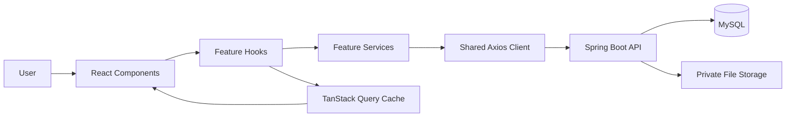

# Frontend Architecture — Personal Vault

> **Project**: Personal Vault — secure storage for credentials, personal identity data, and sensitive documents.
> **Architecture**: Feature-based code organization
> **Audience**: Developers & AI coding assistants working on this codebase

---

## 1. Overview

Personal Vault uses a **feature-based React architecture**. Each business feature owns its pages, components, hooks, API services, types, and local utilities. Shared code is kept small and reusable.

### Technology decisions

| Choice | Reason |
|---|---|
| React with Vite | Simple client-side application suitable for this project |
| TypeScript strict mode | Catches invalid data and API usage early |
| Axios | One configured HTTP client for the Spring Boot API |
| TanStack Query | Manages server data, caching, loading, and mutations |
| Zustand | Manages only small global client state such as the current session |
| React Hook Form + Zod | Handles forms and client-side validation |
| React Router | Handles public, protected, and admin routes |



---

## 2. Folder Structure

```text
src/
├── app/
│   ├── App.tsx
│   └── providers/          # QueryClient, global providers
├── features/
│   ├── auth/               # register, login, logout, session
│   ├── credentials/        # saved platform credentials
│   ├── documents/          # private document files and metadata
│   ├── profile/            # current user profile
│   └── admin/              # user and account management
├── shared/
│   ├── components/         # Button, Input, Modal, FileUploader
│   ├── hooks/               # reusable UI hooks
│   ├── layouts/             # MainLayout, AuthLayout, AdminLayout
│   ├── lib/                 # axios.ts, encryption helpers, query client
│   ├── types/                # common API and user types
│   └── utils/                # date, file, and formatting helpers
├── config/
│   └── constants.ts
├── routes/
│   ├── index.tsx
│   ├── routes.ts
│   ├── ProtectedRoute.tsx
│   └── AdminRoute.tsx
├── assets/
├── styles/
├── main.tsx
└── vite-env.d.ts
```

---

## 3. Feature Anatomy

```text
features/[feature]/
├── components/             # feature-specific UI
├── hooks/                  # feature query and UI hooks
├── services/                # Axios calls for this feature
├── stores/                  # only feature client state when needed
├── types/                   # request, response, and view types
├── utils/                    # feature-specific pure functions
├── pages/                    # route-level components
├── index.ts                  # public exports
└── CONTEXT.md                # feature decisions and data flow
```

**Feature responsibilities**:

| Feature | Responsibility |
|---|---|
| `auth` | Registration, login, logout, session restoration, and current user |
| `credentials` | CRUD for credentials; encrypt the password in the browser before upload |
| `documents` | Upload, list, preview, download, and delete private documents |
| `profile` | Update the authenticated user's profile data |
| `admin` | Manage users and account status; never access another user's private content |

---

## 4. Data Flow

```text
User action → Component → Feature hook → Feature service → Axios → Spring API
                  ↑             ↓
             UI update ← Query cache / mutation result
```

**Examples**:

```text
LoginForm → useLogin() → auth.service.ts → POST /api/v1/auth/login
CredentialForm → encrypt locally → useCreateCredential() → POST /api/v1/credentials
DocumentList → useDocuments() → document.service.ts → GET /api/v1/documents
```

> Components must not call Axios directly. Services must not contain UI logic.

---

## 5. Cross-feature Communication

| Method | Use case |
|---|---|
| Auth store | Current user and session UI state |
| TanStack Query cache | Refresh credentials/documents after mutations |
| URL params | Document or credential detail IDs, filters |
| Shared components | Common UI only |
| Events | Rare decoupled actions — do not use for normal API data |

> Features may import only another feature's public `index.ts` exports. They must not import internal files from another feature.

---

## 6. Routing Structure

```text
Public:
  /login
  /register

Protected:
  /dashboard
  /credentials
  /credentials/:id
  /documents
  /documents/:id
  /profile

Admin:
  /admin/users
```

- Define paths in `routes/routes.ts`.
- Use `ProtectedRoute` for authenticated pages.
- Use `AdminRoute` for pages requiring the admin role.
- Use lazy loading for route-level pages when useful.
- Redirect unauthenticated users to `/login` after a 401 response.

---

## 7. State Management Strategy

| State type | Location | Example |
|---|---|---|
| Server state | TanStack Query | Credentials and documents from API |
| Auth/session UI | Zustand or memory | Current user, session status |
| Form state | React Hook Form | Login and upload forms |
| Local UI state | `useState` | Modal open, selected tab |
| URL state | React Router | Detail ID, filters, pagination |
| Encryption key | Memory only | Credential decryption during session |

> Do not copy all API data into Zustand. TanStack Query is the source of truth for server data.

---

## 8. API Layer

```text
shared/lib/axios.ts
        ↓
features/[feature]/services/*.service.ts
        ↓
features/[feature]/hooks/*.ts
        ↓
features/[feature]/components/*.tsx
```

- Axios uses an environment-based API base URL.
- The interceptor handles common 401 responses and session refresh.
- API request/response types live in the relevant feature's `types/` folder.
- `userId` for ownership is determined by the backend from JWT, not trusted from the UI.
- Document upload uses multipart form data and private storage URLs only.

---

## 9. Shared vs Features

| Shared | Features |
|---|---|
| `Button`, `Input`, `Modal` | `CredentialCard`, `DocumentList` |
| Axios client | `credential.service.ts` |
| Query client | `useDocuments.ts` |
| Generic hooks | `useCredentials.ts` |
| Date/file utilities | `credential.utils.ts` |

---

## 10. Security and API Contract Assumptions

This architecture assumes the backend provides JWT authentication, ownership checks, private document download endpoints, and multipart upload endpoints. Exact paths and DTOs are defined in [`API_SPEC.md`](./API_SPEC.md) and must stay in sync. The web client uses the browser refresh-token cookie flow; the native mobile client uses the native secure-storage flow documented in [`MOBILE-ARCHITECTURE.md`](./MOBILE-ARCHITECTURE.md).

For the MVP, documents are protected with HTTPS, private storage, authorization, file type/size validation, and random storage names. Client-side document encryption is intentionally out of scope for the first version.
