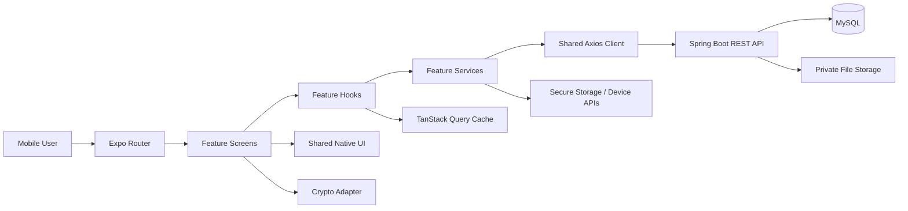

# Mobile Architecture — Personal Vault

> **Project**: Personal Vault
> **Architecture**: React Native + Expo, feature-based client consuming the shared Spring Boot REST API

## 1. Technology Decisions

| Choice | Reason |
|---|---|
| React Native + Expo | Reuses React/TypeScript knowledge while shipping iOS and Android from one codebase |
| Expo Router | File-based, typed navigation with public/protected route groups |
| EAS Build/Submit | Repeatable signed builds and store delivery |
| TanStack Query | Server cache, mutations, retries, invalidation, and offline-aware UI |
| Zustand | Small in-memory session/app-lock state only |
| SecureStore | Keychain/Keystore storage for mobile refresh tokens and wrapped local secrets |
| React Hook Form + Zod | Consistent form state and validation with the web client |
| Axios | Shared API client/interceptor pattern |
| Native crypto adapter | Keeps AES-GCM/project-approved encryption behind a platform boundary |

The recommended MVP is a single mobile app for iOS and Android, backed by the existing API. Do not create a separate mobile backend or duplicate business rules in the app.

## 2. System Overview



The mobile client owns presentation, local session state, device integration, and client-side encryption. The backend remains authoritative for authentication, ownership, validation, and private file access.

## 3. Folder Structure

```text
mobile/
├── app/
│   ├── _layout.tsx
│   ├── (public)/
│   │   ├── _layout.tsx
│   │   ├── login.tsx
│   │   └── register.tsx
│   └── (protected)/
│       ├── _layout.tsx
│       ├── index.tsx
│       ├── credentials/
│       │   ├── index.tsx
│       │   ├── new.tsx
│       │   └── [id].tsx
│       ├── documents/
│       │   ├── index.tsx
│       │   ├── upload.tsx
│       │   └── [id].tsx
│       └── profile.tsx
├── src/
│   ├── features/
│   │   ├── auth/
│   │   ├── credentials/
│   │   ├── documents/
│   │   ├── profile/
│   │   └── settings/
│   ├── shared/
│   │   ├── components/
│   │   ├── hooks/
│   │   ├── lib/
│   │   │   ├── api/
│   │   │   ├── auth/
│   │   │   ├── crypto/
│   │   │   └── storage/
│   │   ├── theme/
│   │   ├── types/
│   │   └── utils/
│   ├── config/
│   └── providers/
├── assets/
├── app.json
├── eas.json
└── package.json
```

## 4. Feature Anatomy and Responsibilities

```text
features/documents/
├── components/                 # DocumentCard, DocumentPickerButton
├── hooks/                      # useDocuments, useUploadDocument
├── services/                   # document.service.ts
├── types/                      # Document.types.ts
├── utils/                      # file validation/formatting
├── screens/                    # list, detail, upload screen compositions
├── index.ts
└── CONTEXT.md
```

| Feature | Responsibility |
|---|---|
| `auth` | Login, register, refresh, logout, current user, app lock |
| `credentials` | CRUD and local encryption/decryption of credential values |
| `documents` | Pick, validate, upload, list, preview, download, delete |
| `profile` | Read and update the current user's profile |
| `settings` | App lock, biometric preference, privacy and session settings |

## 5. Request and State Flow

```text
User action
  → Expo route/screen
  → feature hook
  → feature service
  → Axios + auth interceptor
  → Spring API
  → TanStack Query cache
  → screen state update
```

State boundaries:

| State | Owner |
|---|---|
| Credentials/documents/profile from API | TanStack Query |
| Access token and decrypted credential key | Memory only |
| Refresh token | SecureStore/Keychain/Keystore |
| App lock/session status | Small Zustand store or memory |
| Form values | React Hook Form |
| Current detail ID/filter | Expo Router params/search params |
| Temporary upload progress | Feature hook/local state |

## 6. Authentication and API Contract

The existing API uses JWT and refresh-token rotation. Web may use a secure cookie, but native clients need a native token transport. Add an explicit client type or native auth variant, for example:

```text
POST /api/v1/auth/login
  request: { phone, password, clientType: "mobile" }
  response: { user, accessToken, refreshToken, expiresIn }

POST /api/v1/auth/refresh
  request: { refreshToken }
  response: { accessToken, refreshToken, expiresIn }
```

The backend must hash refresh tokens, rotate them on use, revoke the previous token, and bind sessions to a device/session record. Raw refresh tokens are never logged or returned to another client. A backward-compatible alternative is separate `/auth/mobile/login` and `/auth/mobile/refresh` endpoints.

The client must coordinate refresh requests, retry a failed request once, and clear the session after refresh failure. The API response envelope and domain DTOs remain shared with web.

## 7. Credential Encryption Boundary

```text
Credential form
  → crypto adapter encrypts plaintext locally
  → encrypted payload + IV/nonce → POST /credentials
  → backend stores ciphertext only
  → owner downloads ciphertext
  → crypto adapter decrypts in memory after app unlock
```

- Web and mobile must agree on the algorithm, key derivation, encoding, version, IV/nonce, and authentication-tag format.
- Put the protocol in a versioned shared contract, for example `ciphertextVersion: 1`.
- Use a vetted native crypto implementation compatible with the chosen Expo workflow; do not assume browser `crypto.subtle` exists in React Native.
- The backend must remain unable to decrypt credential values.
- If the existing web format cannot be implemented safely on both platforms, version the format and migrate deliberately; do not silently reinterpret old ciphertext.

## 8. Navigation and UX Architecture

- `(public)` contains login and registration routes.
- `(protected)` checks session state and redirects unauthenticated users to login.
- An app-lock gate may appear inside the protected shell before sensitive screens.
- Credential plaintext is hidden by default and revealed only after explicit user action.
- Use native back behavior, safe areas, keyboard handling, accessibility labels, and clear offline/error states.
- Deep links must resolve only to authorized resources; the API still performs the ownership check.

## 9. Offline and Network Strategy

- MVP: read-through query cache and friendly offline UI; no offline plaintext credential access.
- Queueing document uploads is out of scope until conflict, encryption, and cleanup behavior are specified.
- Retry only idempotent reads and explicitly safe operations; never blindly retry login, logout, or destructive mutations.
- Invalidate affected queries after create/update/delete and show mutation status to the user.

## 10. Testing and Delivery

```text
src/features/**/__tests__/       # hooks, services, validation
src/shared/lib/**/__tests__/     # API, auth, crypto, secure storage adapters
e2e/                             # release-critical flows on iOS/Android
```

- Unit test validation, query behavior, auth refresh coordination, route guards, and crypto known vectors.
- Integration test login, credential CRUD, document upload/download, ownership failures, and app-lock behavior.
- Run lint, typecheck, unit tests, and a signed preview build in CI.
- Keep environment values and EAS secrets outside the repository.
- Release in stages: internal build → preview testers → production store release.

## 11. Architectural Boundaries

| Boundary | Rule |
|---|---|
| `app/` ↔ `src/` | Routes compose screens; business logic stays in features |
| feature ↔ feature | Import public `index.ts` only |
| screen ↔ API | Screen uses hooks, never Axios directly |
| app ↔ device | Use typed adapters for secure storage, crypto, picker, biometrics |
| mobile ↔ backend | Follow `API_SPEC.md`; changes require contract updates |
| backend ↔ private data | Backend authorizes ownership and stores ciphertext/files privately |
